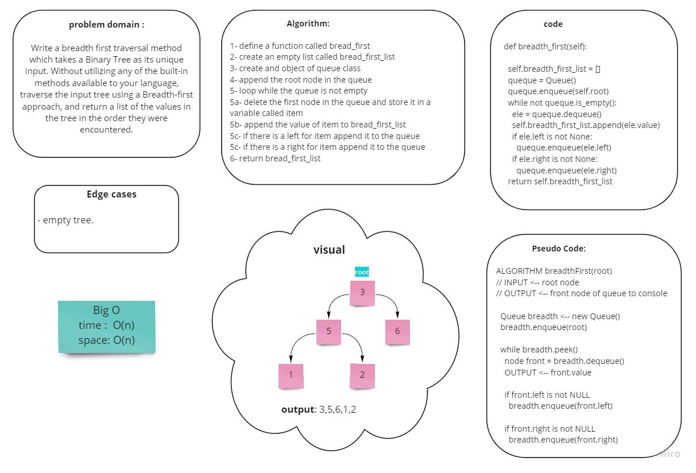

# Trees
<!-- Short summary or background information -->
A tree is a widely used abstract data type that simulates a hierarchical tree structure, with a root value and subtrees of children with a parent node, represented as a set of linked nodes.

A tree data structure can be defined recursively as a collection of nodes (starting at a root node), where each node is a data structure consisting of a value, together with a list of references to nodes (the "children"), with the constraints that no reference is duplicated, and none points to the root.

## Challenge
<!-- Description of the challenge -->
Create a Node class that has properties for the value stored in the node, the left child node, and the right child node.
Create a BinaryTree class
Define a method for each of the depth first traversals called preOrder, inOrder, and postOrder which returns an array of the values, ordered appropriately.
Any exceptions or errors that come from your code should be semantic, capturable errors. For example, rather than a default error thrown by your language, your code should raise/throw a custom, semantic error that describes what went wrong in calling the methods you wrote for this lab.

Create a BinarySearchTree class
Define a method named add that accepts a value, and adds a new node with that value in the correct location in the binary search tree.
Define a method named contains that accepts a value, and returns a boolean indicating whether or not the value is in the tree at least once.

## Approach & Efficiency
<!-- What approach did you take? Why? What is the Big O space/time for this approach? -->
Big O:
- time -> log(n)
- space -> O(1)

## API
<!-- Description of each method publicly available in each of your trees -->
### BinaryTree class
- method `preOrder`, `inOrder`, and `postOrder` which returns an array of the values, ordered appropriately.

### BinarySearchTree class
- `add` that accepts a value, and adds a new node with that value in the correct location in the binary search tree.
- `contains` that accepts a value, and returns a boolean indicating whether or not the value is in the tree at least once.


## Challenge 16 summary:
<!-- Description of the challenge -->
Write an instance method called `find-maximum-value`. Without utilizing any of the built-in methods available to your language, return the maximum value stored in the tree. You can assume that the values stored in the Binary Tree will be numeric.

## Whiteboard Process
<!-- Embedded whiteboard image -->


## Approach & Efficiency
<!-- What approach did you take? Why? What is the Big O space/time for this approach? -->
Big O:
- time -> O(n)
- space -> O(n)

## Solution
<!-- Show how to run your code, and examples of it in action -->

```
  print(binary_tree.find_maximum_value())
```
output: max number


Note: *collaburate with tala and manar*

## Challenge 17 summary:
<!-- Description of the challenge -->
Write a breadth first traversal method which takes a Binary Tree as its unique input. Without utilizing any of the built-in methods available to your language, traverse the input tree using a Breadth-first approach, and return a list of the values in the tree in the order they were encountered.

## Whiteboard Process
<!-- Embedded whiteboard image -->


## Approach & Efficiency
<!-- What approach did you take? Why? What is the Big O space/time for this approach? -->
Big O:
- time -> O(n)
- space -> O(n)

## Solution
<!-- Show how to run your code, and examples of it in action -->

  ```
  node = TNode(2)
  node.left = TNode(7)
  node.right = TNode(5)
  node.left.left = TNode(2)
  node.left.right = TNode(6)
  node.left.left.left = TNode(5)
  node.left.right.right = TNode(11)
  node.right.right = TNode(9)
  node.right.right.left = TNode(4)
  binary_tree = Binary_tree(node)

  print(binary_tree.breadth_first())
  ```
**output**: [2, 7, 5, 2, 6, 9, 5, 11, 4]


Note: *collaburate with tala, manar and raneem.*