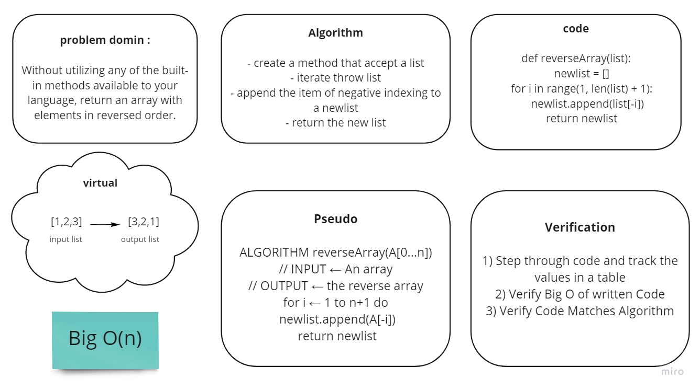

# Reverse an Array
 Python programming language supports negative indexing of arrays. This means that the index value of -1 gives the last element, and -2 gives the second last element of an array. 
 *The negative indexing starts from where the array ends*. 

## Challenge
 Without utilizing any of the built-in methods available to your language, return an array with elements in reversed order.

## Approach & Efficiency
Big O(n) :  A linear algorithm – Runtime grows directly in proportion to n. 

## Solution

