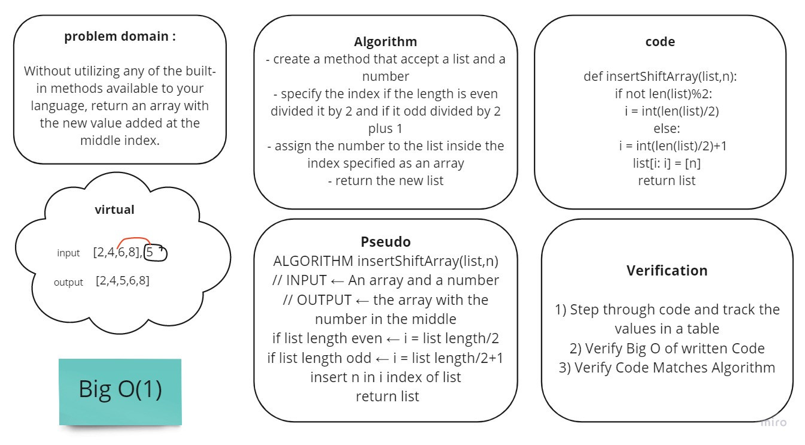

# Challenge Summary
<!-- Short summary or background information -->

## Challenge Description
Without utilizing any of the built-in methods available to your language, return an array with the new value added at the middle index.

## Approach & Efficiency
<!-- What approach did you take? Why? What is the Big O space/time for this approach? -->
- Big O:
 space - O(n)
 time - O(n)

## Solution
