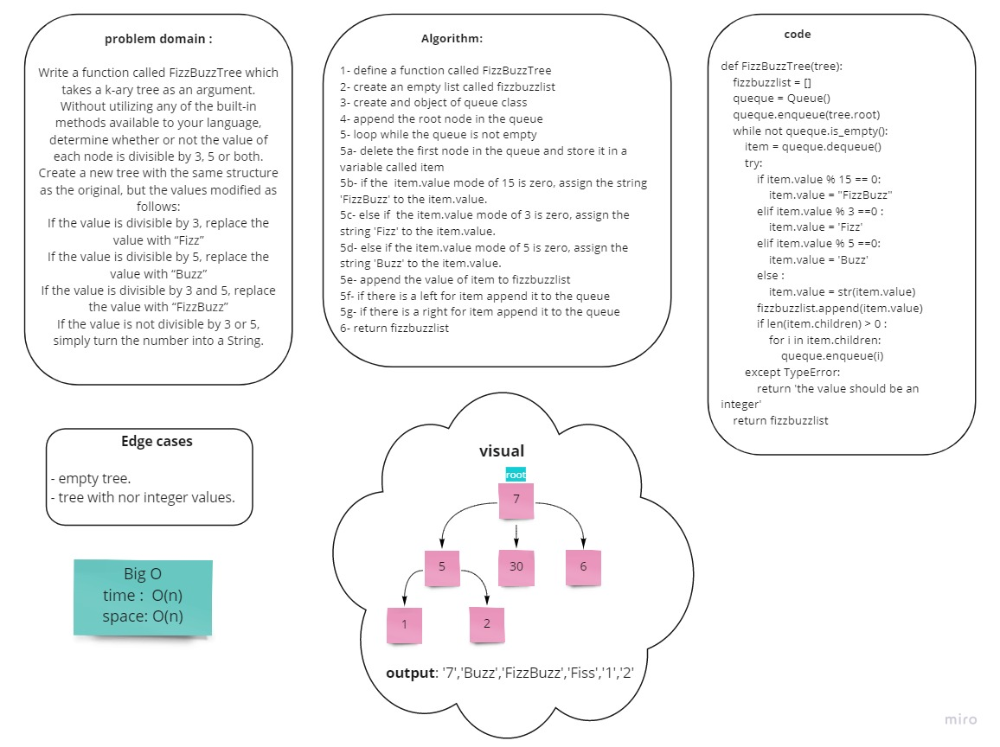

# Challenge Summary
<!-- Description of the challenge -->
- Write a function called FizzBuzzTree which takes a k-ary tree as an argument.
- Without utilizing any of the built-in methods available to your language, determine whether or not the value of each node is divisible by 3, 5 or both. Create a new tree with the same structure as the original, but the values modified as follows:
    - If the value is divisible by 3, replace the value with “Fizz”
    - If the value is divisible by 5, replace the value with “Buzz”
    - If the value is divisible by 3 and 5, replace the value with “FizzBuzz”
    - If the value is not divisible by 3 or 5, simply turn the number into a String.

## Whiteboard Process
<!-- Embedded whiteboard image -->


## Approach & Efficiency
<!-- What approach did you take? Why? What is the Big O space/time for this approach? -->
Big O:
- time -> O(n)
- space -> O(n)


## Solution
<!-- Show how to run your code, and examples of it in action -->
example:

1. create a tree

```
node = KNode(10)
    node.children.append(KNode(5))
    node.children.append(KNode(2))
    node.children.append(KNode(6))
    node.children[0].children.append(KNode(15))
```

2. send the tree to the fizzbuzz function and print the result

```
k_tree = K_ary_tree(node)
    print(FizzBuzzTree(k_tree))
```

- output : `['Buzz', 'Buzz', '2', 'Fizz', 'FizzBuzz']`

Note: *collaburate with tala, manar, noura and raneem.*