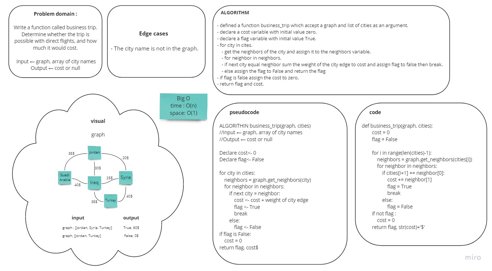

# Challenge Summary
<!-- Description of the challenge -->
Write a function called business trip. Determine whether the trip is possible with direct flights, and how much it would cost.
- Arguments: graph, array of city names
- Return: cost or null

## Whiteboard Process
<!-- Embedded whiteboard image -->

## Approach & Efficiency
<!-- What approach did you take? Why? What is the Big O space/time for this approach? -->
Big O:
- Time -> O(n)
- Space -> O(1)

## Solution
<!-- Show how to run your code, and examples of it in action -->

