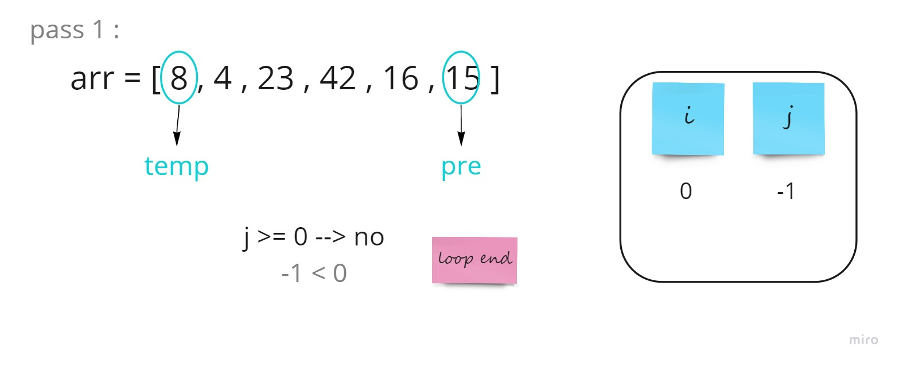

# Insertion Sort

**Insertion sort** is a simple sorting algorithm, the array is virtually split into a sorted and an unsorted part. Values from the unsorted part are picked and placed at the correct position in the sorted part.

- Pass 1 :

- Pass 2 :

- Pass 3 :

- Pass 4 :

- Pass 5 :

- Pass 6 :
