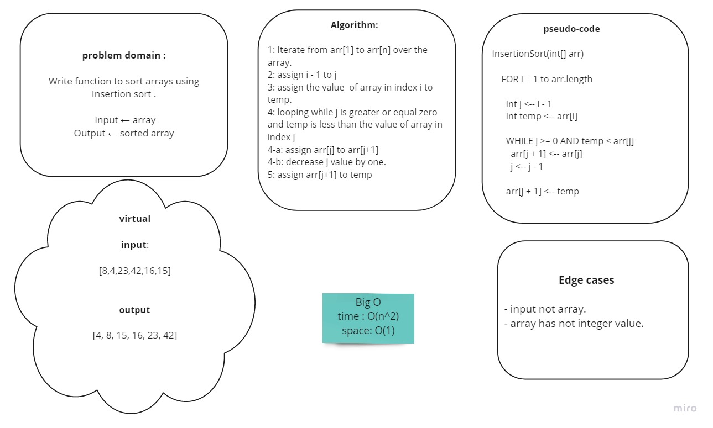

# Challenge Summary
<!-- Description of the challenge -->
**Insertion sort** is a simple sorting algorithm, the array is virtually split into a sorted and an unsorted part. Values from the unsorted part are picked and placed at the correct position in the sorted part.

## Whiteboard Process
<!-- Embedded whiteboard image -->


## Approach & Efficiency
<!-- What approach did you take? Why? What is the Big O space/time for this approach? -->
Big O:
- Time -> O(n^2) 
- Space -> O(1)

## Solution
<!-- Show how to run your code, and examples of it in action -->

- define input array of integers:

```
    arr = [8,4,23,42,16,15]
```


- Call the function and send the array as an argument and print the result:

```
    print(InsertionSort(arr))
```
**output**: [4, 8, 15, 16, 23, 42]


*Collaburated with Manar.*