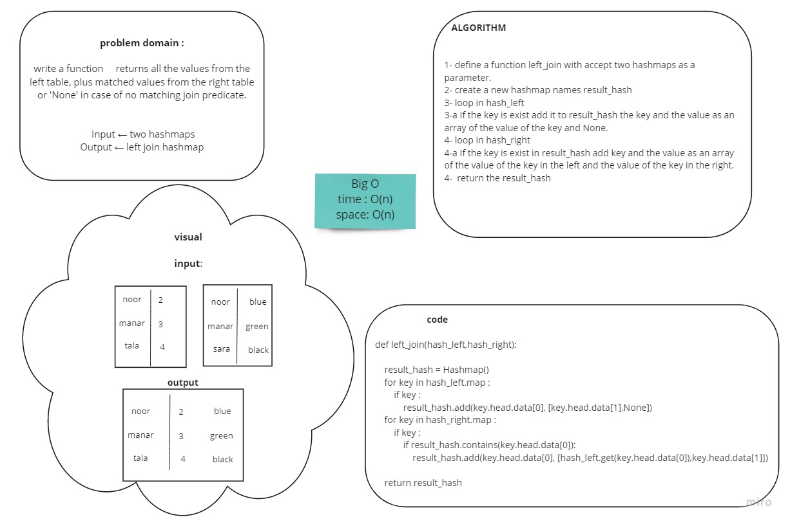

# Hashmap LEFT JOIN
<!-- Short summary or background information -->
**LEFT JOIN** returns all rows from the left table, even if there are no matches in the right table. This means that if the ON clause matches 0 (zero) records in the right table; the join will still return a row in the result, but with `NULL` in each column from the right table.

- This means that a left join returns all the values from the left table, plus matched values from the right table or `NULL` in case of no matching join predicate.

## Challenge
<!-- Description of the challenge -->
- Write a function that LEFT JOINs two hashmaps into a single data structure.
- The first parameter is a hashmap that has word strings as keys, and a synonym of the key as values.
- The second parameter is a hashmap that has word strings as keys, and antonyms of the key as values.
- Combine the key and corresponding values (if they exist) into a new data structure according to LEFT JOIN logic.
- LEFT JOIN means all the values in the first hashmap are returned, and if values exist in the “right” hashmap, they are appended to the result row. If no values exist in the right hashmap, then some flavor of `NULL` should be appended to the result row.
- The returned data structure that holds the results is up to you. It doesn’t need to exactly match the output below, so long as it achieves the LEFT JOIN logic.
- Avoid utilizing any of the library methods available to your language

## Approach & Efficiency
<!-- What approach did you take? Why? What is the Big O space/time for this approach? -->
Big O:
- Time -> O(n) 
- Space -> O(n)

## Solution
<!-- Embedded whiteboard image -->

[code](left_join.py)