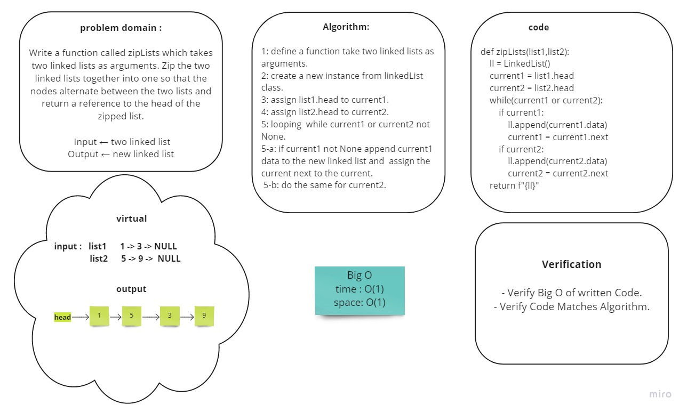

## Challenge 8 Summary
<!-- Description of the challenge -->
Write a function called zipLists which takes two linked lists as arguments. Zip the two linked lists together into one so that the nodes alternate between the two lists and return a reference to the head of the zipped list. 

### Whiteboard Process
<!-- Embedded whiteboard image -->



### Approach & Efficiency
<!-- What approach did you take? Why? What is the Big O space/time for this approach? -->

looping while the current1 or current2 not None, inside the loop append the current data to a new linked list if it exist.


**Big O** :
- Time O(N) 
- space O(1)


### Solution
<!-- Show how to run your code, and examples of it in action -->

 - use LinkdList class method `def zipLists(list1,list2)`:

   *examples*

    ```
    print(list1)
    print(list2)

    print(zipLists(list1,list2))
    ```

      **output** : 
      ```
        1 -> 3 -> NULL
        5 -> 9 -> 4 -> NULL
        1 -> 5 -> 3 -> 9 -> 4 -> NULL
      ```