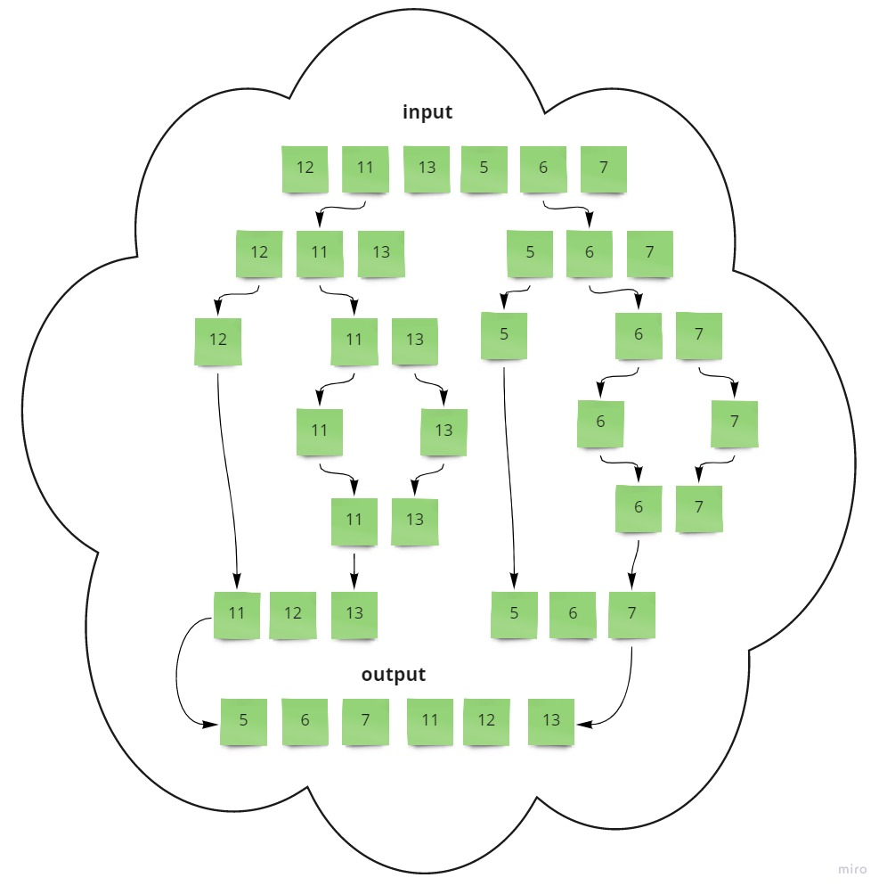

# Merge Sort

## Pseudo Code

```
ALGORITHM Mergesort(arr)
    DECLARE n <-- arr.length
           
    if n > 1
      DECLARE mid <-- n/2
      DECLARE left <-- arr[0...mid]
      DECLARE right <-- arr[mid...n]
      // sort the left side
      Mergesort(left)
      // sort the right side
      Mergesort(right)
      // merge the sorted left and right sides together
      Merge(left, right, arr)

ALGORITHM Merge(left, right, arr)
    DECLARE i <-- 0
    DECLARE j <-- 0
    DECLARE k <-- 0

    while i < left.length && j < right.length
        if left[i] <= right[j]
            arr[k] <-- left[i]
            i <-- i + 1
        else
            arr[k] <-- right[j]
            j <-- j + 1
            
        k <-- k + 1

    if i = left.length
       set remaining entries in arr to remaining values in right
    else
       set remaining entries in arr to remaining values in left

```





## Trace:

**First Split**

left:  [12, 11, 13] right:  [5, 6, 7]


**Split Lift**

left:  [12] right:  [11, 13]

left:  [11] right:  [13]

### Pass 1:
- arr: [11, 13]
    - i = 0 , j = 0 , k = 0
    - left[0] <= right[0] --> 11 <= 13
    - arr[0] = 11 --> arr: [11, 13]
- merge  [11, 13]


### Pass 2:
- arr: [12, 11, 13]
    - i = 0 , j = 0 , k = 0
    - left[0] > right[0] --> 12 > 11
    - arr[0] = 11 --> arr: [11, 11, 13]


- arr: [11, 11, 13]
    - i = 0 , j = 1 , k = 1
    - left[0] <= right[1] --> 12 <= 13
    - arr[1] = 12 --> arr: [11, 12, 13]
- merge  [11, 12, 13]


**Split Right**

left:  [5] right:  [6, 7]

left:  [6] right:  [7]


### Pass 3:
- arr: [6, 7]
    - i = 0 , j = 0 , k = 0
    - left[0] <= right[0] --> 6 <= 7
    - arr[0] = 6 --> arr: [6, 7]
- merge  [6, 7]  


### Pass 4:
- arr: [5, 6, 7]
    - i = 0 , j = 0 , k = 0
    - left[0] <= right[0] --> 5 <= 6
    - arr[0] = 5 --> arr: [5, 6, 7]
- merge  [5, 6, 7] 


### Pass 5:
- arr: [12, 11, 13, 5, 6, 7]
    - i = 0 , j = 0 , k = 0
    - left[0] > right[0] --> 11 > 5
    - arr[0] = 5 --> arr: [5, 11, 13, 5, 6, 7]


- arr: [5, 11, 13, 5, 6, 7]
    - i = 0 , j = 1 , k = 1
    - left[0] > right[1] --> 11 > 6
    - arr[1] = 5 --> arr: [5, 6, 13, 5, 6, 7]


- arr: [5, 6, 13, 5, 6, 7]
    - i = 0 , j = 2 , k = 2
    - left[0] > right[2] --> 11 > 7
    - arr[2] = 5 --> arr: [5, 6, 7, 5, 6, 7]
- merge  [5, 6, 7, 11, 12, 13]


### result: [5, 6, 7, 11, 12, 13]