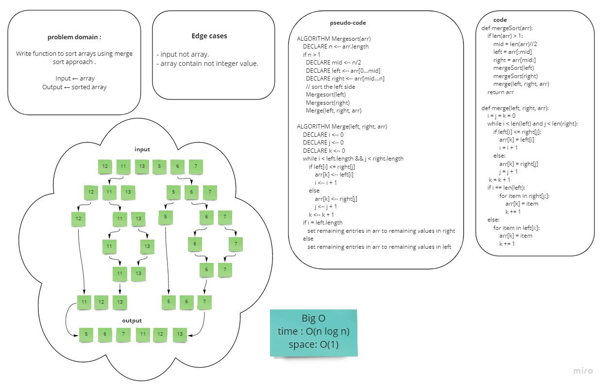

# Challenge Summary
<!-- Description of the challenge -->

Merge sort is a sorting technique based on divide and conquer technique. 

Merge sort first divides the array into equal halves and then combines them in a sorted manner.

## Whiteboard Process
<!-- Embedded whiteboard image -->




## Approach & Efficiency
<!-- What approach did you take? Why? What is the Big O space/time for this approach? -->
Big O
- Time -> O(n log n)
- Space -> O(1)


## Solution
<!-- Show how to run your code, and examples of it in action -->
- define input array of integers:

```
    arr = [8,4,23,42,16,15]
```


- Call the function and send the array as an argument and print the result:

```
    print(mergeSort(arr))
```
**output**: [4, 8, 15, 16, 23, 42]

[code](./merge_sort.py)