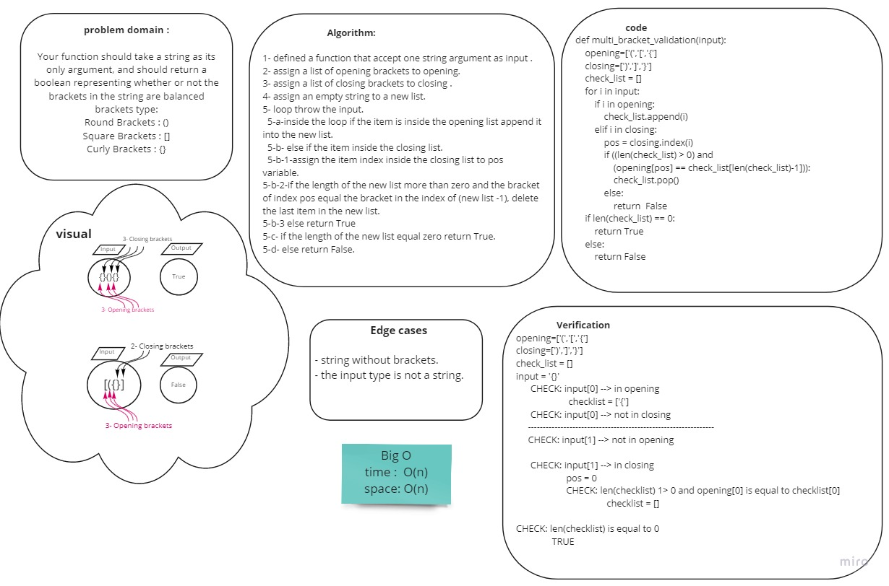

# Challenge Summary
<!-- Description of the challenge -->
 function should take a string as its only argument, and should return a boolean representing whether or not the brackets in the string are balanced. 

 - There are 3 types of brackets:
1. Round Brackets : `()`
1. Square Brackets : `[]`
1. Curly Brackets : `{}`


## Whiteboard Process
<!-- Embedded whiteboard image -->




## Approach & Efficiency
<!-- What approach did you take? Why? What is the Big O space/time for this approach? -->

Big O
- time :O(1)
- space: O(1)

## Solution
<!-- Show how to run your code, and examples of it in action -->
- Example1:

```
print(multi_bracket_validation('[any {Characters}]'))
```
output : `True`

- Example2:

```
print(multi_bracket_validation('[any {Characters)]'))
```
output : `False`