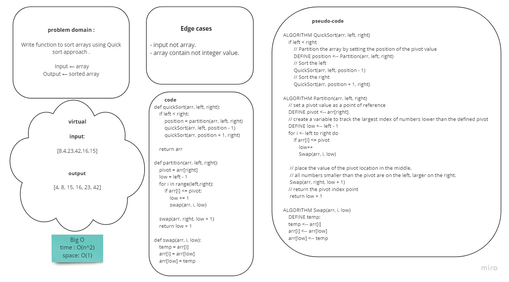

# Challenge Summary
<!-- Description of the challenge -->
Write a function to sort an array using the Quick sort; takes last element as pivot, places the pivot element at its correct position in sorted array, and places all smaller (smaller than pivot) to left of pivot and all greater elements to right of pivot.

## Whiteboard Process
<!-- Embedded whiteboard image -->


## Approach & Efficiency
<!-- What approach did you take? Why? What is the Big O space/time for this approach? -->
Big O:
- time -> O(n^2)
- space -> O(1)

## Solution
<!-- Show how to run your code, and examples of it in action -->
- define input array of integers:

```
    arr = [8, 4, 23, 42, 16, 15]
```

- Assign the length of the array to variable.

```
    n = len(arr)
```

- Call the function and send the array, first index(0) and last index(n-1) of the array as an arguments and print the result:

```
    print(quickSort(arr, 0, n-1))
```

**output**: [4, 8, 15, 16, 23, 42]


- [code](quick_sort.py)