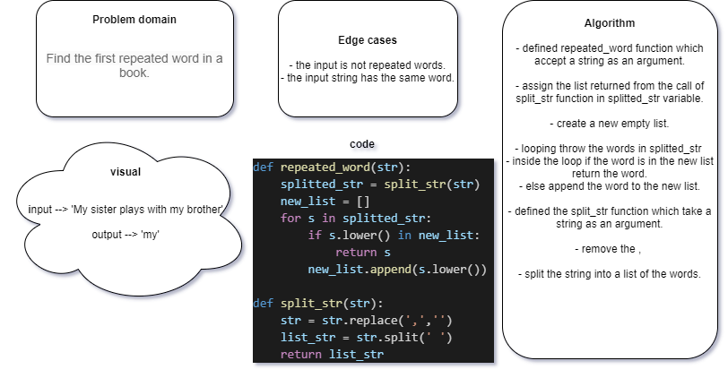

# Challenge Summary
<!-- Description of the challenge -->
Write a function that accepts a lengthy string parameter.
Without utilizing any of the built-in library methods available to your language, return the first word to occur more than once in that provided string.

## Whiteboard Process
<!-- Embedded whiteboard image -->


## Approach & Efficiency
<!-- What approach did you take? Why? What is the Big O space/time for this approach? -->
Big O:
- time -> O(n)
- space -> O(n)

## Solution
<!-- Show how to run your code, and examples of it in action -->
- Assign the string in a variable:

```
    str = "Once upon a time, there was a brave princess who..."
```

- Call the function and send the string and print the result:

```
    print(repeated_word(str))
```
- Run the code

**output** -> 'a'

[code](./repeated_word.py)