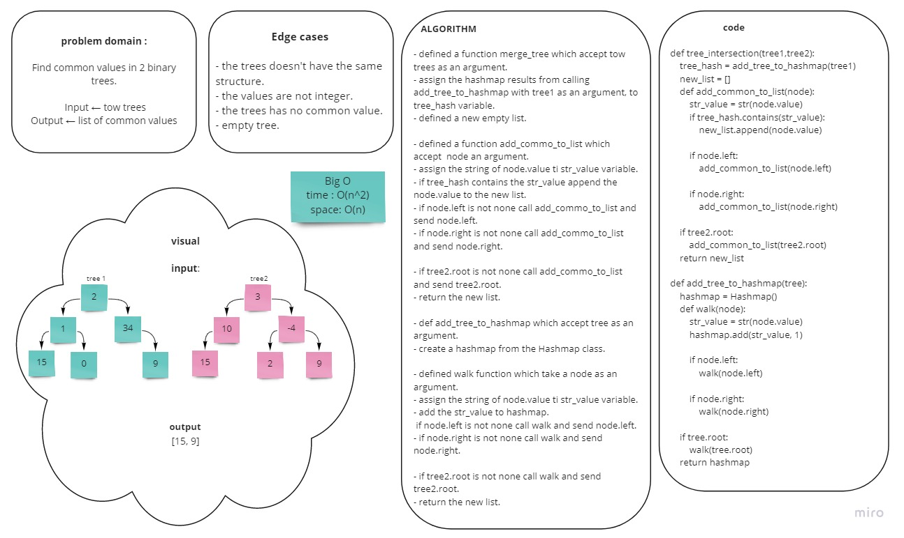

# Challenge Summary
<!-- Description of the challenge -->
Find common values in 2 binary trees.
> Write a function called tree_intersection that takes two binary tree parameters.
Without utilizing any of the built-in library methods available to your language, return a set of values found in both trees.

## Whiteboard Process
<!-- Embedded whiteboard image -->


## Approach & Efficiency
<!-- What approach did you take? Why? What is the Big O space/time for this approach? -->
Big O:
- time -> O(n^2)
- space -> O(n)

## Solution
<!-- Show how to run your code, and examples of it in action -->

- Create two binary trees:
```
  node1 = TNode(1)
  node1.left = TNode(2)
  node1.right = TNode(3)
  node1.right.left = TNode(4)
  node1.right.right = TNode(5)
  tree1 = Binary_tree(node1)

  node2 = TNode(10)
  node2.left = TNode(2)
  node2.right = TNode(3)
  node2.right.left = TNode(9)
  node2.right.right = TNode(-5)
  tree2 = Binary_tree(node2)
```

- Call the function with sending two trees and print the result:

```
    print(tree_intersection(tree1, tree2))
```
- Run the code

**output** -> [2, 3]

[code](tree_intersection.py)