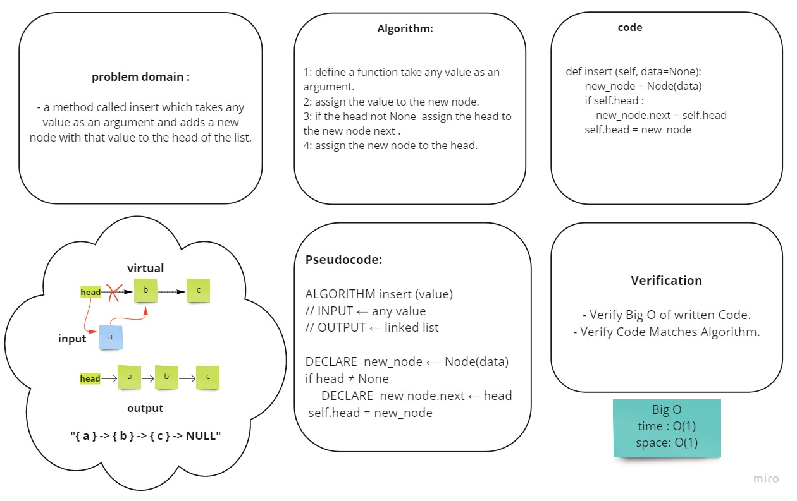
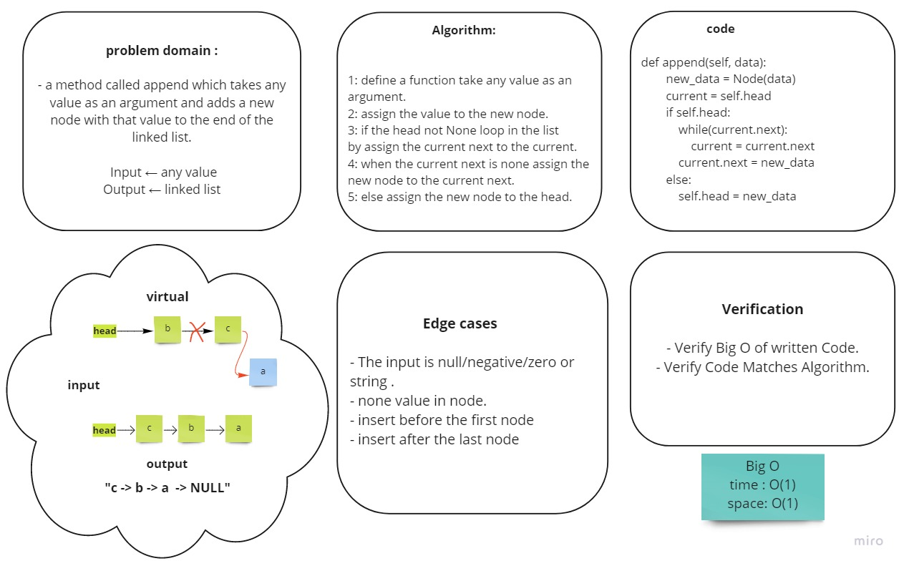
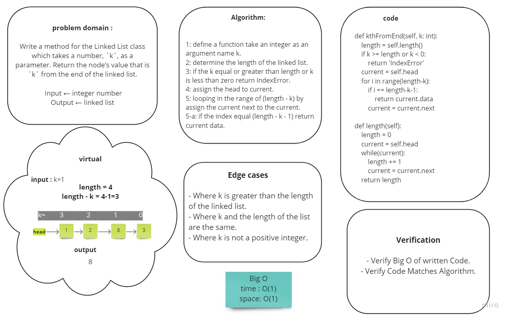

# Singly Linked List

A Linked List is a sequence of Nodes that are connected/linked to each other. The most defining feature of a Linked List is that each Node references the next Node in the link.


- **Get start**:
1. clone the repo `git clone https://github.com/nooromari/data-structures-and-algorithms`

1. change directory `cd data-structures-and-algorithms/python`

1. open linked_list.py in linked_list folder

1. create new instance by write 
   `linked = Linked_list()`


## Challenge 5

Create a Node class that has properties for the value stored in the Node, and a pointer to the next Node.
Within the LinkedList class, include a head property. Upon instantiation, an empty Linked List should be created.

## Approach & Efficiency

### Approach
Singly Linked List

### Efficiency
 - **Big O :**
   - O(1) Time/space performance for **insert** method.
   - O(n) Time and O(1) space performance for **includes** method.


## API

- **insert**: 
a method takes any value as an argument and adds a new node with that value to the head of the list with.

- **includes** : 
a method takes any value as an argument and returns a boolean result depending on whether that value exists as a Node’s value somewhere within the list.


## Solution
- [code](linked_list.py)




## Challenge 6 Summary
<!-- Description of the challenge -->
- Write the following methods for the Linked List class:

  * `.append(value)` which adds a new node with the given value to the end of the list.

  * `.insertBefore(value, newVal)` which add a new node with the given newValue immediately before the first value node.

  * `.insertAfter(value, newVal)` which add a new node with the given newValue immediately after the first value node.


### Whiteboard Process
<!-- Embedded whiteboard image -->



### Approach & Efficiency
<!-- What approach did you take? Why? What is the Big O space/time for this approach? -->

looping through the linked list until find the place we want to insert in it.

*In append method it is in the last node which have a none next.*

**Big O** :
- Time O(N) 
- space O(1)


### Solution
<!-- Show how to run your code, and examples of it in action -->


1. use LinkdList class methods :

   *examples*
    - append 

        ```
          linked.append(1)
          linked.append(3)
          linked.append(2)
        ```

      print linked to see the list result : `print(linked)`

      **output** : "1 -> 3 -> 2 -> NULL"
    
    - insertBefore
      
      ```
      linked.insertBefore(3,5)
      ``` 
      **output** : "1 -> 5 -> 3 -> 2 -> NULL"

    - insertAfter
        
        ```
        linked.insertAfter(3,5)
        ``` 
        **output** : "1 -> 3 -> 5 -> 2 -> NULL"


## Challenge 7 Summary
<!-- Description of the challenge -->
Write a method for the Linked List class which takes a number, `k`, as a parameter. Return the node’s value that is `k` from the end of the linked list.

### Whiteboard Process
<!-- Embedded whiteboard image -->



### Approach & Efficiency
<!-- What approach did you take? Why? What is the Big O space/time for this approach? -->

defined length method which looping through the linked list to calculate the length, then looping in the range of (lenght - k) to find the value of index (kth from the end of the list).


**Big O** :
- Time O(N) 
- space O(1)


### Solution
<!-- Show how to run your code, and examples of it in action -->

 - use LinkdList class method `kthFromEnd(k)`:

   *examples*

    ```
    linked.append(1)
    linked.append(3)
    linked.append(2)
    linked.kthFromEnd(0)
    ```

      **output** : 2
